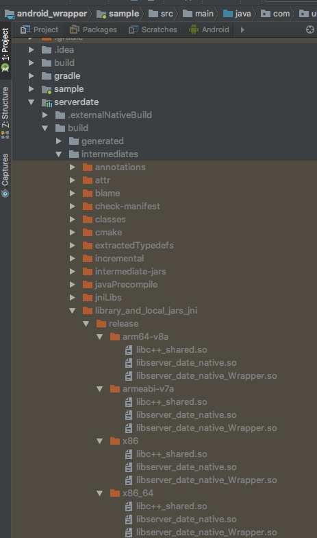
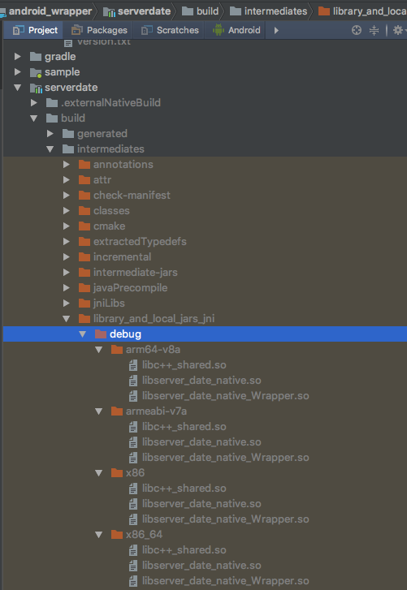

# server date library Android wrapper

This is a java/kotlin library for Android. It provides remote server date synchronisation for a mobile app. This project should be opened in Android Studio IDE v3.1.2.

## Requirements to build the project

### Android SDK Tools (should be installed via [Android SDK Manager](https://developer.android.com/studio/intro/update)):

- Android NDK (r17)
- CMake (min version 3.4.1)

### Global components:

#### SWIG
[SWIG](http://www.swig.org/) is an interface compiler for generating Java classes that are interfaces to C++ classes. To install swig download the package from [http://www.swig.org/download.html](http://www.swig.org/download.html).

SWIG install instruction for Linux/OS X:

- extract the downloaded package
- open the terminal inside the main directory of the extracted package
- run:
	
	```
		$ ./configure
		$ make
		$ make install
	```
- SWIG will be installed in the `/usr/local/bin/` and automatically added to PATH. 
- To test if it works please run `swig -version` in the terminal. The output should be:
	
	```
	mgasztold@mg:~$ swig -version
	
	SWIG Version 3.0.12
	
	Compiled with g++ [x86_64-apple-darwin17.2.0]
	
	Configured options: +pcre
	
	Please see http://www.swig.org for reporting bugs and further information
	```

## How to use android_wrapper project

The sample Android app attached to this project presents a usage of the library. Please note that a valid IP address has to be entered into the constructor.

Kotlin code:
```
val mServerDate = ServerDate("http://192.168.2.242:3000/time_now", applicationContext)
mServerDate.start()
```

## .so files of the C++ server\_date\_native

`server_date_native` lib is built by the Android Studio IDE for all Android architectures:

- arm64-v8a
- armeabi-v7a
- x86
- x86_64 

The files can be found in one of the following directories (depending if you build the project in release or debug variant):

- `android_wrapper/serverdate/build/intermediates/library_and_local_jars_jni/release/`



- `android_wrapper/serverdate/build/intermediates/library_and_local_jars_jni/debug/`


